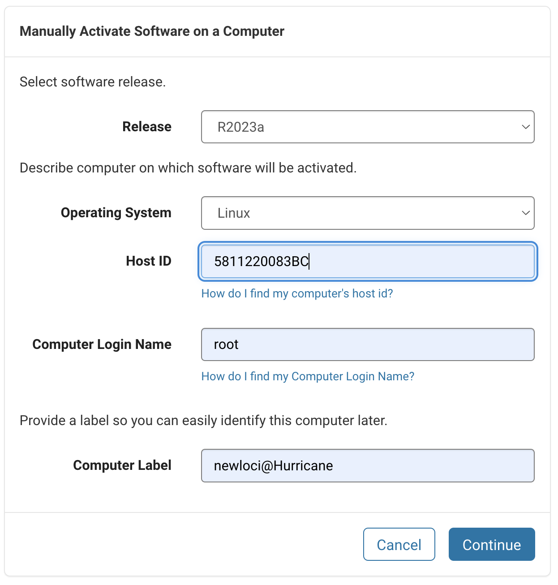

This repository contains the source code for the TANDEM-DIMPLE project. 

Github repository: https://github.com/locitran/tandem-dimple.git

One should build the docker image to execute the code. The following command can be used to build the docker image:

```bash
docker build -t tandem -f docker/Dockerfile .
```

Since this code requires a MATLAB license, you may need to [get a license file](#obtain-matlab-license-for-a-computer-from-this-link) to run the code. Once you have the license file, you can run the code using the following command:

```bash
docker run -it \
  --volume $HOME/input:/root/input \
  --volume $HOME/output:/root/output \
  --volume <MATLAB LICENSE FILE PATH>:/root/matlab_license \
  --mac-address=<MAC_ADDRESS_OF_MACHINE> \
  -e MLM_LICENSE_FILE=/root/matlab_license/license.lic \
  tandem bash
```

If you are using **Hurricane** server, you can use the following command to run the code:
```bash
docker run -it \
  --volume /mnt/Tsunami_HHD/newloci/NativeEnsembleWeb_copy/tandem:/tandem \
  --mac-address=58:11:22:00:83:bc \
  -e MLM_LICENSE_FILE=/tandem/matlab_license_hurricane.lic \
  --name tandem \
  -u root \
  tandem bash
``` 

After tandem container is created, you can run it in interactive mode using the following command:
```bash
docker start tandem
docker exec -it tandem bash
```

Once you get into the container, you can exec the test file `python test.py`


```bibtex
@article{Loci2025,
  author  = {Loci Tran, Chen-Hua Lu, Pei-Lung Chen, Lee-Wei Yang},
  journal = {Bioarchiv},
  title   = {Predicting the pathogenicity of SAVs Transfer-leArNing-ready and Dynamics-Empowered Model for DIsease-specific Missense Pathogenicity Level Estimation},
  year    = {2025},
  volume  = {*.*},
  number  = {*.*},
  pages   = {*.*},
  doi     = {*.*}
}
```   

# Obtain MATLAB license for a computer from this [link](https://www.mathworks.com/licensecenter/licenses/40638624/4628136/activations)

- **Step 1**: Log in your account. In case you want to obtain the license through NTHU, check this [instruction](https://learning.site.nthu.edu.tw/var/file/319/1319/img/2902/1090423NationalTsingHuaUniversity_ENGInstallationGuideline-V9.pdf).
- **Step 2**: From tag `Install and Activate`, select `View activated computers`.
- **Step 3**: Select the `Activate a Computer` button and fill the form.

<div style="text-align: center;">
    
</div>

- **Step 4**: Follow the instructions and download the license file.

## Host ID (MAC Address of Primary Network Interface):
```bash
ip link show

# One of the outputs should look like this:
3: eno2: <BROADCAST,MULTICAST,UP,LOWER_UP> mtu 1500 qdisc mq state UP mode DEFAULT group default qlen 1000
    link/ether **58:11:22:00:83:bc** brd ff:ff:ff:ff:ff:ff
```

# For Singularity

Save docker image to a file `docker save <image_name>:<tag> -o <image_name>.tar`
```bash
export TMPDIR=/raid/YangLab/loci/ # Only for A100
docker save tandem -o tandem.tar
singularity build tandem docker-archive://tandem.tar # Build SANBOX image from docker image
unset TMPDIR # remove variable
```
