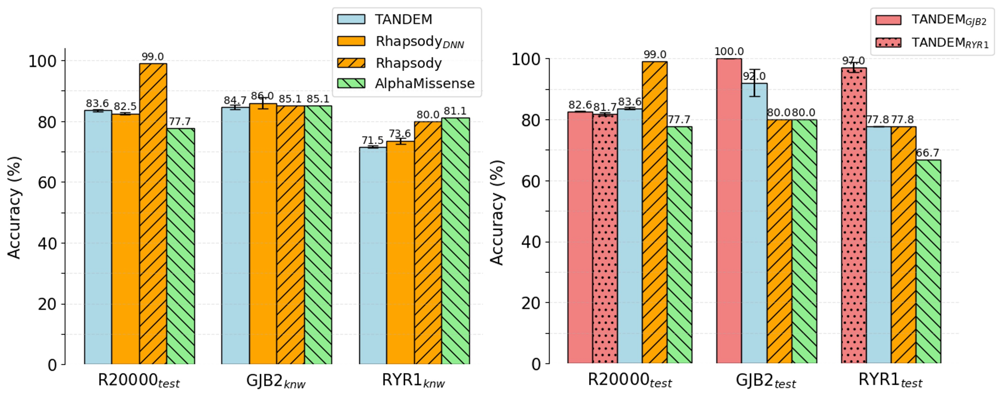

This repository contains the source code for the TANDEM-DIMPLE project. 

Github repository: https://github.com/locitran/tandem-dimple.git. 

TANDEM-DIMPLE is a DNN model designed to predict the pathogenicity of missense variants. The model is trained on R20000 set obtained from the [Rhapsody](https://academic.oup.com/bioinformatics/article/36/10/3084/5758260?login=true) study, using a wide range of features, including sequence&chemical, structural, and dynamics features.


Figure 3.8. Comparison of model accuracy for TANDEMgeneral (TANDEM), TANDEMspecific_disease (TANDEMGJB2, TANDEMRYR1), Rhapsody and AlphaMissense.
Among the 20,361 SAVs from Rhapsody(Ponzoni et al., 2020), the R20000 test set here comprises 62 Uniprot protein sequences corresponding 2,043 SAVs (about 10% of the total data).


This repository contains:
1. The code to produce the features
2. [TANDEM-DIMPLE model](models/different_number_of_layers/20250423-1234-tandem/n_hidden-5)
3. Transfer-learned model for two specific diseases: [GJB2](models/transfer_learning_GJB2) and [RYR1](models/TransferLearning_RYR1).

To install the code, please follow this [instruction](docs/installation.md).

Input format and output format are described in the [input_output_format.md](docs/input_output_format.md) file.


```bibtex
@article{Loci2025,
  author  = {Loci Tran, Chen-Hua Lu, Pei-Lung Chen, Lee-Wei Yang},
  journal = {Bioarchiv},
  title   = {Predicting the pathogenicity of SAVs Transfer-leArNing-ready and Dynamics-Empowered Model for DIsease-specific Missense Pathogenicity Level Estimation},
  year    = {2025},
  volume  = {*.*},
  number  = {*.*},
  pages   = {*.*},
  doi     = {*.*}
}
```   